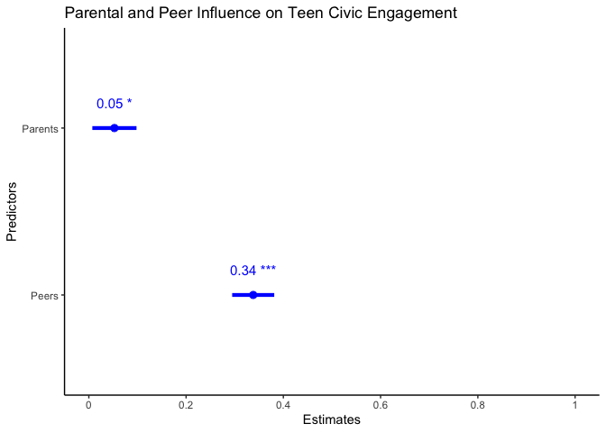
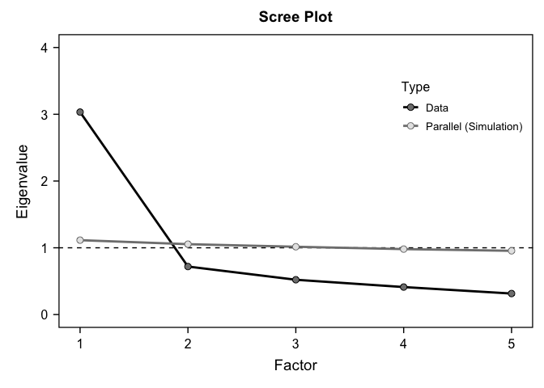
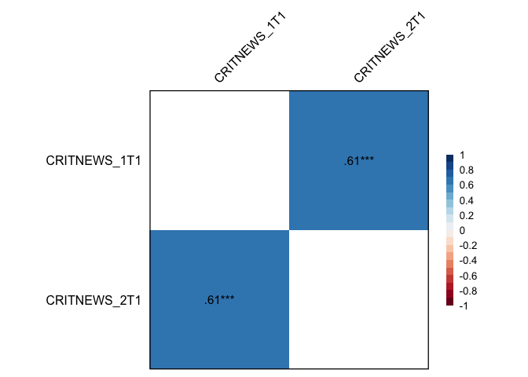

Final Version of MyProject_PSY329
================
Mursal Jahed
2024-10-11

Load packages

``` r
library(haven)
library(dplyr)
```

    ## 
    ## Attaching package: 'dplyr'

    ## The following objects are masked from 'package:stats':
    ## 
    ##     filter, lag

    ## The following objects are masked from 'package:base':
    ## 
    ##     intersect, setdiff, setequal, union

``` r
library(ggplot2)
library(tidyr) 
library(psych)
```

    ## Warning: package 'psych' was built under R version 4.3.3

    ## 
    ## Attaching package: 'psych'

    ## The following objects are masked from 'package:ggplot2':
    ## 
    ##     %+%, alpha

``` r
library(car)
```

    ## Loading required package: carData

    ## 
    ## Attaching package: 'car'

    ## The following object is masked from 'package:psych':
    ## 
    ##     logit

    ## The following object is masked from 'package:dplyr':
    ## 
    ##     recode

``` r
library(lmtest)
```

    ## Loading required package: zoo

    ## 
    ## Attaching package: 'zoo'

    ## The following objects are masked from 'package:base':
    ## 
    ##     as.Date, as.Date.numeric

``` r
library(performance)
```

    ## Warning: package 'performance' was built under R version 4.3.3

``` r
library(sjPlot)
```

    ## Warning: package 'sjPlot' was built under R version 4.3.3

``` r
library(bruceR)
```

    ## Warning: package 'bruceR' was built under R version 4.3.3

    ## 
    ## bruceR (v2024.6)
    ## Broadly Useful Convenient and Efficient R functions
    ## 
    ## Packages also loaded:
    ## ✔ data.table ✔ emmeans
    ## ✔ dplyr      ✔ lmerTest
    ## ✔ tidyr      ✔ effectsize
    ## ✔ stringr    ✔ performance
    ## ✔ ggplot2    ✔ interactions
    ## 
    ## Main functions of `bruceR`:
    ## cc()             Describe()  TTEST()
    ## add()            Freq()      MANOVA()
    ## .mean()          Corr()      EMMEANS()
    ## set.wd()         Alpha()     PROCESS()
    ## import()         EFA()       model_summary()
    ## print_table()    CFA()       lavaan_summary()
    ## 
    ## For full functionality, please install all dependencies:
    ## install.packages("bruceR", dep=TRUE)
    ## 
    ## Online documentation:
    ## https://psychbruce.github.io/bruceR
    ## 
    ## To use this package in publications, please cite:
    ## Bao, H.-W.-S. (2024). bruceR: Broadly useful convenient and efficient R functions (Version 2024.6) [Computer software]. https://CRAN.R-project.org/package=bruceR

    ## 
    ## These packages are dependencies of `bruceR` but not installed:
    ## - pacman, openxlsx, ggtext, vars, phia, MuMIn, GGally
    ## 
    ## ***** Install all dependencies *****
    ## install.packages("bruceR", dep=TRUE)

Load dataset

``` r
load("/Users/mursal_j/Downloads/ICPSR_36561/DS0001/36561-0001-Data.rda")
```

Select variables

``` r
list_projectdata <- da36561.0001 %>% 
  select(PEERCIVACT1, PEERVAL_2T1, PEERVAL_4T1, PEERVAL_5T1, PARCIVT1, PARCIV_1T1, PARCIV_4T1, PARCIV_2T1, PARCIV_3T1, COMMMEANT1, YIIACTS_3T1, YIIACTS_5T1, YIIACTS_11T1, YIIACTS_13T1, YIIACTS_15T1, PEERINVT1, PEERCIV_1T1, PEERCIV_2T1, PEERCIV_3T1, GENDERT1, GRADET1, CRITNEWST1, CRITNEWS_1T1, CRITNEWS_2T1)
```

Checking for Assumptions

``` r
model <- lm(COMMMEANT1 ~ PARCIVT1 + PEERINVT1, data = list_projectdata)
check_model(model)
```

<!-- -->

``` r
summary(model)
```

    ## 
    ## Call:
    ## lm(formula = COMMMEANT1 ~ PARCIVT1 + PEERINVT1, data = list_projectdata)
    ## 
    ## Residuals:
    ##      Min       1Q   Median       3Q      Max 
    ## -2.05818 -0.49009  0.03388  0.50710  2.11368 
    ## 
    ## Coefficients:
    ##             Estimate Std. Error t value Pr(>|t|)    
    ## (Intercept)  1.49570    0.07186  20.816   <2e-16 ***
    ## PARCIVT1     0.05260    0.02316   2.271   0.0233 *  
    ## PEERINVT1    0.33802    0.02205  15.327   <2e-16 ***
    ## ---
    ## Signif. codes:  0 '***' 0.001 '**' 0.01 '*' 0.05 '.' 0.1 ' ' 1
    ## 
    ## Residual standard error: 0.7066 on 1414 degrees of freedom
    ##   (161 observations deleted due to missingness)
    ## Multiple R-squared:  0.1851, Adjusted R-squared:  0.1839 
    ## F-statistic: 160.6 on 2 and 1414 DF,  p-value: < 2.2e-16

Analysis - How do parental vs peer civic involvement influence civic
involvement in teenagers?

``` r
plot_model(model,  type ="est",  show.values = TRUE, vline.color = "#1B191999", line.size = 1.5, dot.size = 2.5, colors = "blue")
```

<!-- -->

``` r
tab_model(model)
```

<table style="border-collapse:collapse; border:none;">
<tr>
<th style="border-top: double; text-align:center; font-style:normal; font-weight:bold; padding:0.2cm;  text-align:left; ">
 
</th>
<th colspan="3" style="border-top: double; text-align:center; font-style:normal; font-weight:bold; padding:0.2cm; ">
COMMMEANT1
</th>
</tr>
<tr>
<td style=" text-align:center; border-bottom:1px solid; font-style:italic; font-weight:normal;  text-align:left; ">
Predictors
</td>
<td style=" text-align:center; border-bottom:1px solid; font-style:italic; font-weight:normal;  ">
Estimates
</td>
<td style=" text-align:center; border-bottom:1px solid; font-style:italic; font-weight:normal;  ">
CI
</td>
<td style=" text-align:center; border-bottom:1px solid; font-style:italic; font-weight:normal;  ">
p
</td>
</tr>
<tr>
<td style=" padding:0.2cm; text-align:left; vertical-align:top; text-align:left; ">
(Intercept)
</td>
<td style=" padding:0.2cm; text-align:left; vertical-align:top; text-align:center;  ">
1.50
</td>
<td style=" padding:0.2cm; text-align:left; vertical-align:top; text-align:center;  ">
1.35 – 1.64
</td>
<td style=" padding:0.2cm; text-align:left; vertical-align:top; text-align:center;  ">
<strong>\<0.001</strong>
</td>
</tr>
<tr>
<td style=" padding:0.2cm; text-align:left; vertical-align:top; text-align:left; ">
PARCIVT1
</td>
<td style=" padding:0.2cm; text-align:left; vertical-align:top; text-align:center;  ">
0.05
</td>
<td style=" padding:0.2cm; text-align:left; vertical-align:top; text-align:center;  ">
0.01 – 0.10
</td>
<td style=" padding:0.2cm; text-align:left; vertical-align:top; text-align:center;  ">
<strong>0.023</strong>
</td>
</tr>
<tr>
<td style=" padding:0.2cm; text-align:left; vertical-align:top; text-align:left; ">
PEERINVT1
</td>
<td style=" padding:0.2cm; text-align:left; vertical-align:top; text-align:center;  ">
0.34
</td>
<td style=" padding:0.2cm; text-align:left; vertical-align:top; text-align:center;  ">
0.29 – 0.38
</td>
<td style=" padding:0.2cm; text-align:left; vertical-align:top; text-align:center;  ">
<strong>\<0.001</strong>
</td>
</tr>
<tr>
<td style=" padding:0.2cm; text-align:left; vertical-align:top; text-align:left; padding-top:0.1cm; padding-bottom:0.1cm; border-top:1px solid;">
Observations
</td>
<td style=" padding:0.2cm; text-align:left; vertical-align:top; padding-top:0.1cm; padding-bottom:0.1cm; text-align:left; border-top:1px solid;" colspan="3">
1417
</td>
</tr>
<tr>
<td style=" padding:0.2cm; text-align:left; vertical-align:top; text-align:left; padding-top:0.1cm; padding-bottom:0.1cm;">
R<sup>2</sup> / R<sup>2</sup> adjusted
</td>
<td style=" padding:0.2cm; text-align:left; vertical-align:top; padding-top:0.1cm; padding-bottom:0.1cm; text-align:left;" colspan="3">
0.185 / 0.184
</td>
</tr>
</table>

Analysis - How does this relationship change if the teens’ critical news
consumption is taken into account? Checking assumptions

``` r
model <- lm(COMMMEANT1 ~ CRITNEWST1 + PARCIVT1 + PEERINVT1, data = list_projectdata)
check_model(model)
```

<!-- -->

``` r
summary(model)
```

    ## 
    ## Call:
    ## lm(formula = COMMMEANT1 ~ CRITNEWST1 + PARCIVT1 + PEERINVT1, 
    ##     data = list_projectdata)
    ## 
    ## Residuals:
    ##     Min      1Q  Median      3Q     Max 
    ## -2.0548 -0.4843  0.0286  0.4884  2.0147 
    ## 
    ## Coefficients:
    ##             Estimate Std. Error t value Pr(>|t|)    
    ## (Intercept)  1.33121    0.07650  17.402  < 2e-16 ***
    ## CRITNEWST1   0.10577    0.01818   5.818 7.38e-09 ***
    ## PARCIVT1     0.03427    0.02311   1.483    0.138    
    ## PEERINVT1    0.30247    0.02266  13.346  < 2e-16 ***
    ## ---
    ## Signif. codes:  0 '***' 0.001 '**' 0.01 '*' 0.05 '.' 0.1 ' ' 1
    ## 
    ## Residual standard error: 0.6986 on 1411 degrees of freedom
    ##   (163 observations deleted due to missingness)
    ## Multiple R-squared:  0.2041, Adjusted R-squared:  0.2024 
    ## F-statistic: 120.6 on 3 and 1411 DF,  p-value: < 2.2e-16

Analysis

``` r
plot_model(model, type = "est", show.values = TRUE, vline.color = "#1B191999", 
           line.size = 1.5, dot.size = 2.5, colors = "blue", 
           terms = c("CRITNEWST1", "PARCIVT1", "PEERINVT1"))
```

<!-- -->

``` r
tab_model(model)
```

<table style="border-collapse:collapse; border:none;">
<tr>
<th style="border-top: double; text-align:center; font-style:normal; font-weight:bold; padding:0.2cm;  text-align:left; ">
 
</th>
<th colspan="3" style="border-top: double; text-align:center; font-style:normal; font-weight:bold; padding:0.2cm; ">
COMMMEANT1
</th>
</tr>
<tr>
<td style=" text-align:center; border-bottom:1px solid; font-style:italic; font-weight:normal;  text-align:left; ">
Predictors
</td>
<td style=" text-align:center; border-bottom:1px solid; font-style:italic; font-weight:normal;  ">
Estimates
</td>
<td style=" text-align:center; border-bottom:1px solid; font-style:italic; font-weight:normal;  ">
CI
</td>
<td style=" text-align:center; border-bottom:1px solid; font-style:italic; font-weight:normal;  ">
p
</td>
</tr>
<tr>
<td style=" padding:0.2cm; text-align:left; vertical-align:top; text-align:left; ">
(Intercept)
</td>
<td style=" padding:0.2cm; text-align:left; vertical-align:top; text-align:center;  ">
1.33
</td>
<td style=" padding:0.2cm; text-align:left; vertical-align:top; text-align:center;  ">
1.18 – 1.48
</td>
<td style=" padding:0.2cm; text-align:left; vertical-align:top; text-align:center;  ">
<strong>\<0.001</strong>
</td>
</tr>
<tr>
<td style=" padding:0.2cm; text-align:left; vertical-align:top; text-align:left; ">
CRITNEWST1
</td>
<td style=" padding:0.2cm; text-align:left; vertical-align:top; text-align:center;  ">
0.11
</td>
<td style=" padding:0.2cm; text-align:left; vertical-align:top; text-align:center;  ">
0.07 – 0.14
</td>
<td style=" padding:0.2cm; text-align:left; vertical-align:top; text-align:center;  ">
<strong>\<0.001</strong>
</td>
</tr>
<tr>
<td style=" padding:0.2cm; text-align:left; vertical-align:top; text-align:left; ">
PARCIVT1
</td>
<td style=" padding:0.2cm; text-align:left; vertical-align:top; text-align:center;  ">
0.03
</td>
<td style=" padding:0.2cm; text-align:left; vertical-align:top; text-align:center;  ">
-0.01 – 0.08
</td>
<td style=" padding:0.2cm; text-align:left; vertical-align:top; text-align:center;  ">
0.138
</td>
</tr>
<tr>
<td style=" padding:0.2cm; text-align:left; vertical-align:top; text-align:left; ">
PEERINVT1
</td>
<td style=" padding:0.2cm; text-align:left; vertical-align:top; text-align:center;  ">
0.30
</td>
<td style=" padding:0.2cm; text-align:left; vertical-align:top; text-align:center;  ">
0.26 – 0.35
</td>
<td style=" padding:0.2cm; text-align:left; vertical-align:top; text-align:center;  ">
<strong>\<0.001</strong>
</td>
</tr>
<tr>
<td style=" padding:0.2cm; text-align:left; vertical-align:top; text-align:left; padding-top:0.1cm; padding-bottom:0.1cm; border-top:1px solid;">
Observations
</td>
<td style=" padding:0.2cm; text-align:left; vertical-align:top; padding-top:0.1cm; padding-bottom:0.1cm; text-align:left; border-top:1px solid;" colspan="3">
1415
</td>
</tr>
<tr>
<td style=" padding:0.2cm; text-align:left; vertical-align:top; text-align:left; padding-top:0.1cm; padding-bottom:0.1cm;">
R<sup>2</sup> / R<sup>2</sup> adjusted
</td>
<td style=" padding:0.2cm; text-align:left; vertical-align:top; padding-top:0.1cm; padding-bottom:0.1cm; text-align:left;" colspan="3">
0.204 / 0.202
</td>
</tr>
</table>

Testing reliability

``` r
#Reliability of COMMMEANT1/Teen community service
Alpha(list_projectdata, vars=c("YIIACTS_3T1", "YIIACTS_5T1", "YIIACTS_11T1", "YIIACTS_13T1", "YIIACTS_15T1"))
```

    ## 
    ## Reliability Analysis
    ## 
    ## Summary:
    ## Total Items: 5
    ## Scale Range: 1 ~ 4
    ## Total Cases: 1578
    ## Valid Cases: 1432 (90.7%)
    ## 
    ## Scale Statistics:
    ## Mean = 2.651
    ## S.D. = 0.781
    ## Cronbach’s α = 0.836
    ## McDonald’s ω = 0.839
    ## 
    ## Item Statistics (Cronbach’s α If Item Deleted):
    ## ───────────────────────────────────────────────────────
    ##                Mean    S.D. Item-Rest Cor. Cronbach’s α
    ## ───────────────────────────────────────────────────────
    ## YIIACTS_3T1   2.670 (0.930)          0.692        0.789
    ## YIIACTS_5T1   2.865 (0.917)          0.494        0.839
    ## YIIACTS_11T1  2.671 (1.067)          0.716        0.779
    ## YIIACTS_13T1  2.534 (0.971)          0.617        0.808
    ## YIIACTS_15T1  2.516 (1.125)          0.677        0.792
    ## ───────────────────────────────────────────────────────
    ## Item-Rest Cor. = Corrected Item-Total Correlation

``` r
#Reliability of PEERINVT1/Peer civic involvement
Alpha(list_projectdata, vars=c("PEERCIV_1T1", "PEERCIV_2T1", "PEERCIV_3T1"))
```

    ## 
    ## Reliability Analysis
    ## 
    ## Summary:
    ## Total Items: 3
    ## Scale Range: 1 ~ 5
    ## Total Cases: 1578
    ## Valid Cases: 1443 (91.4%)
    ## 
    ## Scale Statistics:
    ## Mean = 3.007
    ## S.D. = 0.927
    ## Cronbach’s α = 0.700
    ## McDonald’s ω = 0.714
    ## 
    ## Item Statistics (Cronbach’s α If Item Deleted):
    ## ──────────────────────────────────────────────────────
    ##               Mean    S.D. Item-Rest Cor. Cronbach’s α
    ## ──────────────────────────────────────────────────────
    ## PEERCIV_1T1  2.890 (1.164)          0.506        0.622
    ## PEERCIV_2T1  2.615 (1.133)          0.596        0.511
    ## PEERCIV_3T1  3.516 (1.217)          0.455        0.689
    ## ──────────────────────────────────────────────────────
    ## Item-Rest Cor. = Corrected Item-Total Correlation

``` r
#Reliability of PARCIVT1/Parental civic involvement
Alpha(list_projectdata, vars=c("PARCIV_1T1", "PARCIV_4T1", "PARCIV_2T1", "PARCIV_3T1"))
```

    ## 
    ## Reliability Analysis
    ## 
    ## Summary:
    ## Total Items: 4
    ## Scale Range: 1 ~ 5
    ## Total Cases: 1578
    ## Valid Cases: 1437 (91.1%)
    ## 
    ## Scale Statistics:
    ## Mean = 2.615
    ## S.D. = 0.883
    ## Cronbach’s α = 0.830
    ## McDonald’s ω = 0.841
    ## 
    ## Item Statistics (Cronbach’s α If Item Deleted):
    ## ─────────────────────────────────────────────────────
    ##              Mean    S.D. Item-Rest Cor. Cronbach’s α
    ## ─────────────────────────────────────────────────────
    ## PARCIV_1T1  2.617 (1.041)          0.745        0.748
    ## PARCIV_4T1  2.966 (1.157)          0.505        0.857
    ## PARCIV_2T1  2.378 (1.050)          0.714        0.762
    ## PARCIV_3T1  2.500 (1.087)          0.691        0.771
    ## ─────────────────────────────────────────────────────
    ## Item-Rest Cor. = Corrected Item-Total Correlation

``` r
#Reliability of CRITNEWST1 (Spearman's Rho) - need to create a data set and only select those two
spearman_for_critnewst1 <- da36561.0001 %>% 
  select(CRITNEWS_1T1, CRITNEWS_2T1)
Corr(spearman_for_critnewst1, method = "spearman")
```

    ## NOTE: `CRITNEWS_1T1`, `CRITNEWS_2T1` transformed to numeric.
    ## 
    ## Spearman's r and 95% confidence intervals:
    ## ───────────────────────────────────────────────────────────
    ##                               r     [95% CI]     p        N
    ## ───────────────────────────────────────────────────────────
    ## CRITNEWS_1T1-CRITNEWS_2T1  0.61 [0.58, 0.64] <.001 *** 1546
    ## ───────────────────────────────────────────────────────────

<!-- -->

    ## Correlation matrix is displayed in the RStudio `Plots` Pane.

Factor Analysis

``` r
#FA of COMMMEANT1/Teen community service
EFA(list_projectdata, vars=c("YIIACTS_3T1", "YIIACTS_5T1", "YIIACTS_11T1", "YIIACTS_13T1", "YIIACTS_15T1"), method = "pa", plot.scree = TRUE, nfactors = c("parallel"))
```

    ## 
    ## Explanatory Factor Analysis
    ## 
    ## Summary:
    ## Total Items: 5
    ## Scale Range: 1 ~ 4
    ## Total Cases: 1578
    ## Valid Cases: 1432 (90.7%)
    ## 
    ## Extraction Method:
    ## - Principal Axis Factor Analysis
    ## Rotation Method:
    ## - (Only one component was extracted. The solution was not rotated.)
    ## 
    ## KMO and Bartlett's Test:
    ## - Kaiser-Meyer-Olkin (KMO) Measure of Sampling Adequacy: MSA = 0.832
    ## - Bartlett's Test of Sphericity: Approx. χ²(10) = 2734.97, p < 1e-99 ***
    ## 
    ## Total Variance Explained:
    ## ───────────────────────────────────────────────────────────────────────────────
    ##           Eigenvalue Variance % Cumulative % SS Loading Variance % Cumulative %
    ## ───────────────────────────────────────────────────────────────────────────────
    ## Factor 1       3.033     60.657       60.657      2.574     51.476       51.476
    ## Factor 2       0.719     14.383       75.040                                   
    ## Factor 3       0.521     10.428       85.468                                   
    ## Factor 4       0.412      8.239       93.708                                   
    ## Factor 5       0.315      6.292      100.000                                   
    ## ───────────────────────────────────────────────────────────────────────────────
    ## 
    ## Factor Loadings (Sorted by Size):
    ## ───────────────────────────────
    ##                 PA1 Communality
    ## ───────────────────────────────
    ## YIIACTS_11T1  0.808       0.652
    ## YIIACTS_3T1   0.769       0.591
    ## YIIACTS_15T1  0.762       0.580
    ## YIIACTS_13T1  0.676       0.458
    ## YIIACTS_5T1   0.541       0.293
    ## ───────────────────────────────
    ## Communality = Sum of Squared (SS) Factor Loadings
    ## (Uniqueness = 1 - Communality)

<!-- -->

``` r
#FA of PEERCIVACT1/Peer civic involvement
EFA(list_projectdata, vars=c("PEERCIV_1T1", "PEERCIV_2T1", "PEERCIV_3T1"), method = "pa", plot.scree = TRUE, nfactors = c("parallel"))
```

    ## 
    ## Explanatory Factor Analysis
    ## 
    ## Summary:
    ## Total Items: 3
    ## Scale Range: 1 ~ 5
    ## Total Cases: 1578
    ## Valid Cases: 1443 (91.4%)
    ## 
    ## Extraction Method:
    ## - Principal Axis Factor Analysis
    ## Rotation Method:
    ## - (Only one component was extracted. The solution was not rotated.)
    ## 
    ## KMO and Bartlett's Test:
    ## - Kaiser-Meyer-Olkin (KMO) Measure of Sampling Adequacy: MSA = 0.644
    ## - Bartlett's Test of Sphericity: Approx. χ²(3) = 823.92, p < 1e-99 ***
    ## 
    ## Total Variance Explained:
    ## ───────────────────────────────────────────────────────────────────────────────
    ##           Eigenvalue Variance % Cumulative % SS Loading Variance % Cumulative %
    ## ───────────────────────────────────────────────────────────────────────────────
    ## Factor 1       1.885     62.845       62.845      1.383     46.094       46.094
    ## Factor 2       0.664     22.119       84.964                                   
    ## Factor 3       0.451     15.036      100.000                                   
    ## ───────────────────────────────────────────────────────────────────────────────
    ## 
    ## Factor Loadings (Sorted by Size):
    ## ──────────────────────────────
    ##                PA1 Communality
    ## ──────────────────────────────
    ## PEERCIV_2T1  0.825       0.681
    ## PEERCIV_1T1  0.635       0.404
    ## PEERCIV_3T1  0.546       0.298
    ## ──────────────────────────────
    ## Communality = Sum of Squared (SS) Factor Loadings
    ## (Uniqueness = 1 - Communality)

<!-- -->

``` r
#FA of PARCIVT1/Parental civic involvement
EFA(list_projectdata, vars=c("PARCIV_1T1", "PARCIV_2T1", "PARCIV_3T1", "PARCIV_4T1"), method = "pa", plot.scree = TRUE, nfactors = c("parallel"))
```

    ## 
    ## Explanatory Factor Analysis
    ## 
    ## Summary:
    ## Total Items: 4
    ## Scale Range: 1 ~ 5
    ## Total Cases: 1578
    ## Valid Cases: 1437 (91.1%)
    ## 
    ## Extraction Method:
    ## - Principal Axis Factor Analysis
    ## Rotation Method:
    ## - (Only one component was extracted. The solution was not rotated.)
    ## 
    ## KMO and Bartlett's Test:
    ## - Kaiser-Meyer-Olkin (KMO) Measure of Sampling Adequacy: MSA = 0.795
    ## - Bartlett's Test of Sphericity: Approx. χ²(6) = 2398.79, p < 1e-99 ***
    ## 
    ## Total Variance Explained:
    ## ───────────────────────────────────────────────────────────────────────────────
    ##           Eigenvalue Variance % Cumulative % SS Loading Variance % Cumulative %
    ## ───────────────────────────────────────────────────────────────────────────────
    ## Factor 1       2.690     67.245       67.245      2.305     57.622       57.622
    ## Factor 2       0.651     16.271       83.516                                   
    ## Factor 3       0.368      9.204       92.720                                   
    ## Factor 4       0.291      7.280      100.000                                   
    ## ───────────────────────────────────────────────────────────────────────────────
    ## 
    ## Factor Loadings (Sorted by Size):
    ## ─────────────────────────────
    ##               PA1 Communality
    ## ─────────────────────────────
    ## PARCIV_1T1  0.858       0.736
    ## PARCIV_2T1  0.806       0.649
    ## PARCIV_3T1  0.789       0.622
    ## PARCIV_4T1  0.546       0.298
    ## ─────────────────────────────
    ## Communality = Sum of Squared (SS) Factor Loadings
    ## (Uniqueness = 1 - Communality)

<!-- -->
